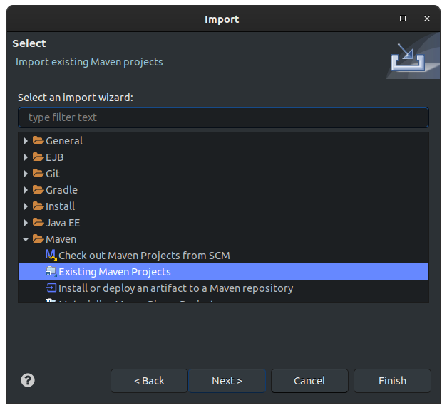
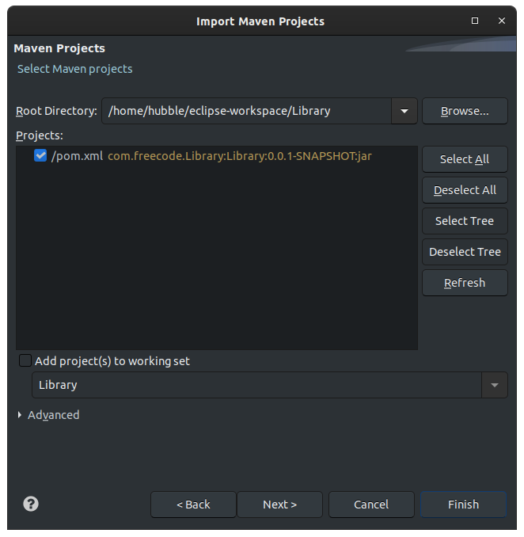
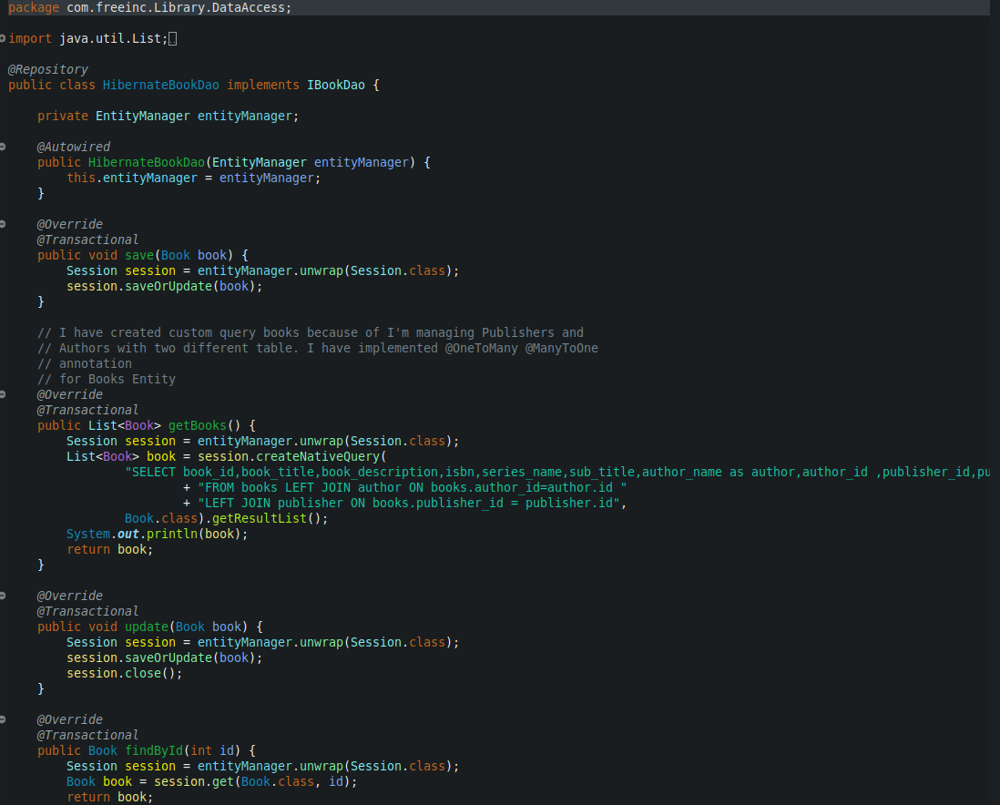
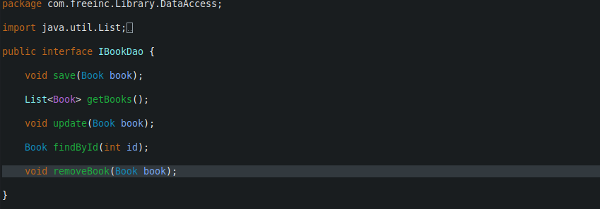
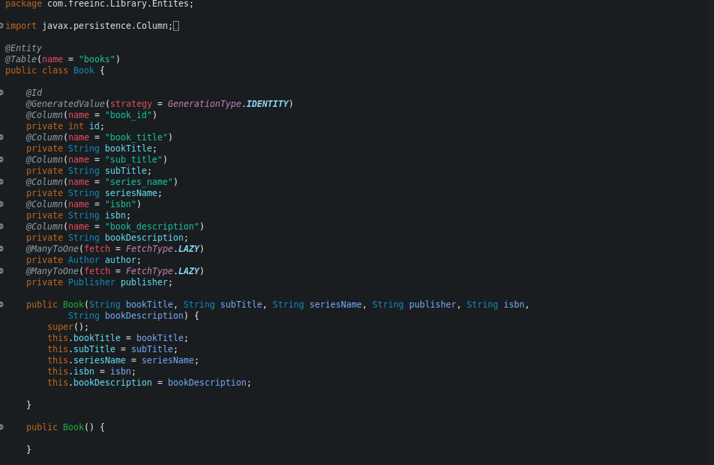

# Free Inc. Library Challange

## Scenario of Project

 In this project spesific we have three  type of users.

* Admin
* Moderator
* User

### Users username and passwords

* User
  * user12345
* moderator
  * moderator12345
* admin
  * admin12345

### Privileges of users

* Admin
  * Can add,delte and update Author , Publisher , Author
* Moderator
  * Can add book and update a book
* Users
  * Can see books

For a fresh start if you want to signup you will authorize as a user. If you want to get privileges of Admin or moderator your should contact with system manager. I will add some let us know feature in next version of project. That way you do not  need to contact with system manager directly.
System manager mean you should change your user role directly from database. I know this is very gutter. I will make project more User friendly  in next version.

## Installation

 Depends on a couple of Java ide I will try to explain how to install project and make   sure works everything fine.

### Eclipse

 

>We should import our project  as a existing maven project after install the project source code.

>Hit the finish and magic will start.When process finished if you update maven project  it should be nice for environment setup.

***Let's get the exiting point together. Project explanation and used dependencies section***

## Project Structure and Which design patern I have used

This project main idea  Open Source Library Management System. I have used two main tool for make and build this project. Spring Boot for back-end development and Thymeleaf for front-end(___client side___).

### Section one Backend side with design patterns

* IoC(___Inversion of control___)
* Dependency Injection (___Mostly I used to constructor injection method___)

 When I started to learn spring boot first thing that I have learned " __We should create our Layers as much as possible independent__" I will explain that with my own codes as I declare below.

In data access layer  have one IoC implements IBookDao. When our application start to work we need to save a new book to database then IoC help us for calling spesific part which we declareted here like __save(Book book)__  when save process finish then Spring Boot takes control back. That make app more faster and more maintainable. There is also other benefits for understanding a little bit deeper  let's look at my IBookDao interface.

Basically we can say for this interface isolate methods and make them more independent  and modularize. This principal of Desing patern also helps us for create more qualified test units.

**Lets's talk about what's Dependecy Injection and How I used to in this project.**

As we talked earlier in IoC section frameworks helps us for just interest with __business logic__ and provide us biggest advantage for create our project Frameworks independent while doing that uses Dependecy Injection.

* What's the advantages of Dependecy Injection ?

  * Helps for use object to give as outsource instead of use directly. That's helps us for make minimise dependencies of objects each other.
  * When do you started to write Unit test for your application makes easier and quite more qualified probability of correctness.

**Let's look at  on the code.**

>Book Entity

We have getters and setters. If we  use those getters and setters directly we will make our application dependece to when we call any of those method. This is very bad for maintainable and testable code. So how should we access for those getters and setters.

As you see in here my HibernateBookDao has Book entity as a parameter in method. I like to use Hibernate Orm  in this example of code I started a session  and unwarped  Entity Manager packet methods for  spesific scope.We made everything independent from Book Entity.

**I hope, I was declarative as much as possible for understanding basically. I'm on searching more qualified technic for explain see you in next update.**
